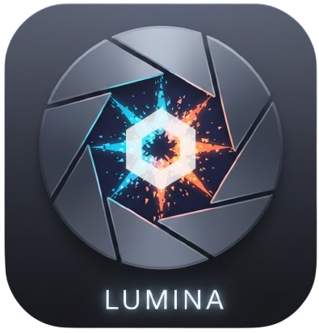

<p align="center">

</p>

# Lumina for Obsidian

[](LICENSE)  [](https://github.com/infinition/obsidian-lumina/releases) [](https://obsidian.md/plugins?id=lumina) [](https://buymeacoffee.com/infinition)

A media gallery plugin for Obsidian. Lumina turns your vault into a visual browser for images, videos, PDFs, and audio files with a lightbox viewer, tagging system, and multi-select editing.

---

## Features

- Gallery view showing all media in your vault or a specific folder.
- Lightbox with left/right navigation and zoom.
- Tag system: tag files directly from the gallery, with tag indicators in the file explorer.
- Multi-select with Ctrl+Click for bulk operations.
- Keyboard shortcuts: arrow keys to navigate, Escape to close, Ctrl+Wheel to zoom, Ctrl+A to select all.
- Virtual search integration: include media in Obsidian's native search.
- Configurable click actions per media type.
- Multilingual: 5 languages.

---

## Shortcuts

| Shortcut | Action |
|----------|--------|
| Left / Right | Navigate lightbox |
| Escape | Close / exit mode |
| Ctrl+Click | Multi-select |
| Shift+T | Tag selected files |
| Ctrl+Wheel | Zoom gallery |
| Ctrl+A | Select all (edit mode) |
| Double-click | Open lightbox |

---

## Development

```bash
git clone https://github.com/infinition/obsidian-lumina.git
npm install
npm run dev    # watch mode
npm run build
```

---

## Star History

<a href="https://www.star-history.com/?repos=infinition%2Fobsidian-lumina&type=date&legend=top-left">
 <picture>
   <source media="(prefers-color-scheme: dark)" srcset="https://api.star-history.com/chart?repos=infinition/obsidian-lumina&type=date&theme=dark&legend=top-left" />
   <source media="(prefers-color-scheme: light)" srcset="https://api.star-history.com/chart?repos=infinition/obsidian-lumina&type=date&legend=top-left" />
   
 </picture>
</a>

---

## License

MIT. See [LICENSE](LICENSE).
